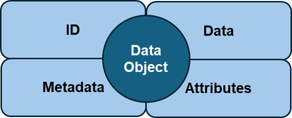
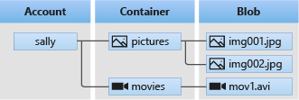
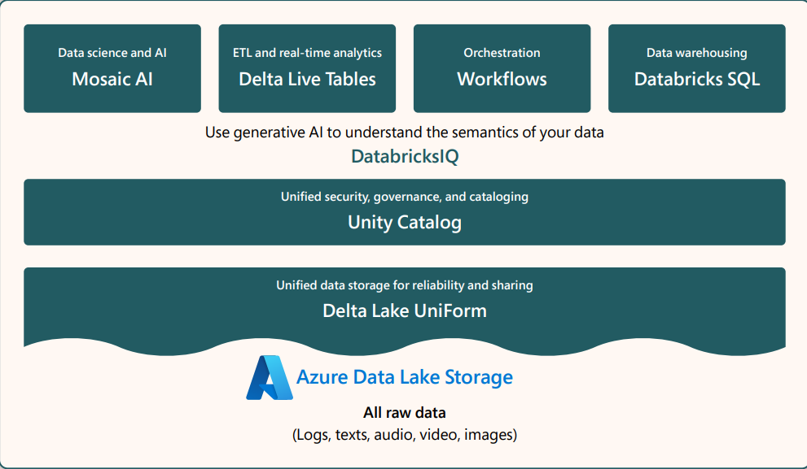
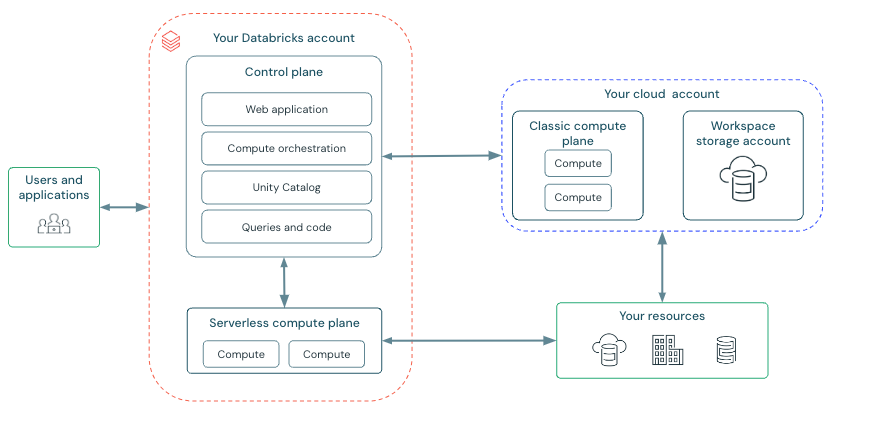
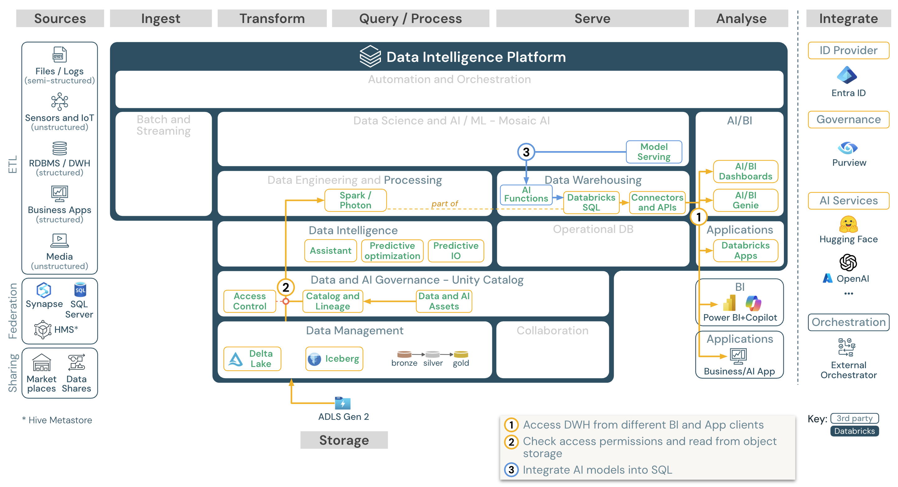
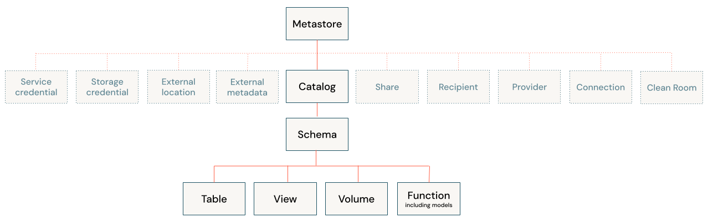

## Cloud Storage:

### Data Storage Methodologies:

**1.    Object Storage:** Object storage or Object based storage is a data storage methodology where data files are broken into multiple little pieces called objects and are spread across multiple network systems. Instead of using a hierarchical format of directory trees object storage store data in a flat structure, such that every object can be accessed using every object's unique path which generally exists in the form [```dbfs://file-location/bucket-name/object_id ```]

-   ID: Every data object has a unique ID that's part of  it's path.
-   Metadata: Metadata contains further information about the data like data type, owner info etc.
-   Attibutes: Attributes are similar to metadata in that they contain important information about the object essential for maintaining data integrity and security. Key attributes of a data object can be User priviledges, constraints etc.

**Advantages:** Data Objects ensure Scalability, Data Security, Replication and cost savings.
<p align="center">        

</p>

**2.    File Storage:**  
File Storage is often referred as file system or file-level storage, in the modern context file storage have been referred as NAS (Network attached storage), they allow users/applications to access data across various networks through directory trees, folders and individual files. A file storage behaves as a physical storage, however a NAS also called a NOS (Network operating system) manages access and read-write operations to it.  
File storage can be very easily configurable but access to it is constrained by a single path making it less performant as compared to Object or block storage. File storage depends on the storage system employed such New technologies file system (NTFS) for windows or Network file system (NFS) for linux.

**3.    Block Storage:** 

Block storage allow creation of raw storage volumes that any virtual operating system connected to the network can access them, block storage act as multiple hard disks connected to the network and can be utilised for multiple use cases such file storage, database storage and for creating Virtual machine file system (VMFS) volumes.

-   SANs
-   RAID Arrays

### Azure Blob Storage:

Azure Blob storage a Object based cloud storage platform offered by Microsoft that can be utilized by enterprises and individuals to store large amount of unstructured data to the cloud. 

**Blob Storage Resources:**  
Azure blob storage offers three type of resources:
1.  Storage Account
2.  A Container in the storage account
3.  A blob in the container

<p align="center">

</p>

1.  **Storage Account:** A Storage account in Azure offers a unique namespace for your data in azure. Every object stored in azure can be accessed by using the unique account name. A combination of account name and storage endpoints forms the base address of stored object.

2.  **Containers:** A container orgainzes a set of blob storages similar to a directory for folders. A storage account can store a number of containers and a container can store a number of blobs.  
A container name must be a valid DNS address as it forms part of the URI (Uniform Resource Idenfier) of the object (Container, blob or file) that needs to be accessed.

3.  **Blobs (binary large objects):** Blobs are the smallest unit of the azure object storage model. They can further contain files but 

### Azure data lake gen2:

Azure data lake gen2 is a file-based storage layer built on top of Azure blob storage that allows enterprises to store structured, semi-structured and unstructured data and also perform big data workloads over their data at scale.

Azure data lake is set of capabilities that augment big data analytics like:
-   compatibility with Hadoob distributed file system (HDFS)   
-   Hierarchical namespaces
-   
-   
-   


### Azure Databricks:

Azure databricks is unified open analytics platform that combines unique capabilities of data warehouses and data lakes for bulding, deploying and maintaining enterprise grade data, Analytics and ML applications at scale.  

Key technologies native to the databricks ecosystem are :

-   Delta lake & Delta sharing
-   Apache spark & Structured streaming
-   ML Flow
-   Redash
-   Unity catalog

<p align="center">

</p>

Databricks combines Apache spark and Delta lakes to create a fast and reliable ETL experience where SQL, Python and Scala can be utilised to compose ETL logics and orchestrate scheduled jobs effortlessly.

### Delta Lake:

The term Delta was conceived with Delta lake for managing transactional real-time data and batch big data processing. Delta lake extends the capabilities of parquet files by adding a file-based transaction log layer over the data for providing capabilities such as ACID transactions, data versioning ,rollback capabilities and scalable metadata handling.

<a title = "Delta Table reference" href = "https://docs.delta.io/latest/table-properties.html#">-   Delta table properties reference</a>

### Azure Databricks Architecture:

Azure Databricks operates out of a **Control Plane** and a **Compute Plan**, seperating the computational processes from the interactive user side of operations.

<p align="center">

</p>

**Data lakehouse architecture:**
For BI and SQL operations data lakehouse architecture operates in the following manner:
<p align="center">

</p>

### Compute:

Azure databricks compute refers to the compute resources associated with your Azure databricks workspace.Users need access to AD compute to run data engineering, data analytics and data science workloads, such as production ETL pipelines, streaming analytics, Ad-hoc analytics, ML and AI.

**Types of Compute resources:**

1.  Serverless compute for analytics
2.  Serverless compute for jobs
3.  All purpose compute
4.  Jobs compute
5.  Instance compute
6.  Serverless SQL warehouse
7.  Classic SQL warehouse

### Unity Catalog:

Unity catalog is a centralized data catalog that provides access control, auditing, lineage, quality monitoring, data discovery capabilities across all user workspaces.

Key features of Unity catalog:

-   Define once secure everywhere: single place to administer data governance policies that are valid across all workspaces

-   **Standards-compliant security model:** Based on standard ANSI-SQL security model, allowing administrators to grant access to their existing data lake using familiar syntax

-   **Built in auditing and lineage:** Records user level audit log and maintains data lineage, thus users can view who has accessed their data and also control versions of it.

-   **Data discovery:** Unified platform for taging and searching data.

-   **System tables:** Allows access to accont's operational data (Audit logs, billable usage & lineage)

**Unity Catalog Object model:**
<p>

</p>

Unity catalog metastore contains three level object hierarchy, catalog -> Schemas (databases) -> Data & AI models, objects in unity catalog can be accessed by ```catalog.schema.table_name```


### Data bricks Access control lists:

Unity 


