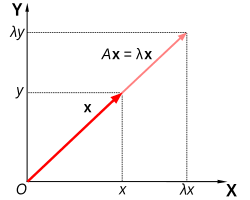
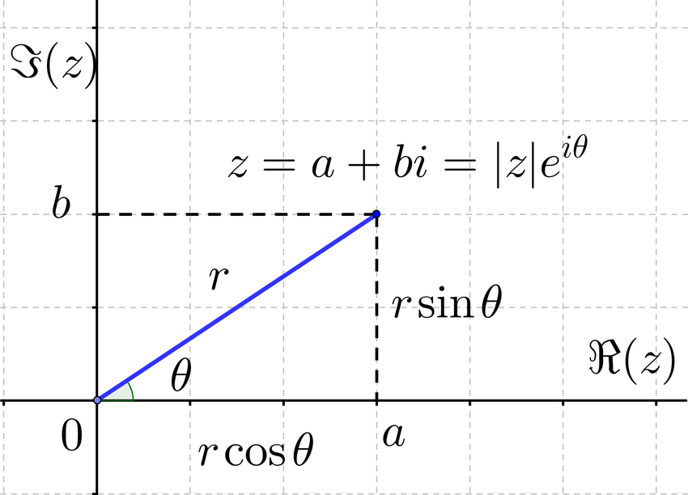

## Matrix Operations:

### Linear regression:

Given data $\{(x_1, y_1), (x_2, y_2), \dots, (x_n, y_n)\}, x_i \in \mathbb{R}^d, y_i \in \mathbb{R},   i= 1,2,\dots, n$ the loss function would is,

```math
\begin{align}
L(\theta)&= \frac{1}{2} \sum_{i=1}^{n}(x_i^T\theta - y_i)^2
\end{align}
```
for minimizing L: Define 
```math
\begin{array}{cc}
A&= \begin{bmatrix}
x_1^T \\
x_2^T \\
\vdots
\\ x_n^T
\end{bmatrix}
& \leftarrow \quad \text{\{feature matrix\}}
&, Y=
\begin{bmatrix}
y_1 \\
y_2 \\
\vdots
\\ y_n
\end{bmatrix}
\end{array}
\begin{array}{cc}
A\theta = \begin{bmatrix}
x_1^T \theta \\
x_2^T \theta\\
\vdots
\\ x_n^T \theta
\end{bmatrix} \implies 
(A\theta - Y)= \begin{bmatrix}
x_1^T - y_1\\
x_2^T - y_2\\
\vdots
\\ x_n^T - y_n
\end{bmatrix}
\end{array}

\begin{array}{cc}
(A\theta - Y)^T(A\theta - Y)&=  \sum_{1}^{n}(x_i^T\theta - y_i)^2
\end{array}
```
so, $\begin{align}
L(\theta)&= \frac{1}{2} (A\theta - Y)^T(A\theta - Y)
\end{align}$

Minimizing L:
```math
\begin{array}{cc}
\nabla_\theta(A\theta - Y)^T(A\theta - Y)&= 0 \\
\implies A^T(A\theta - Y)&= 0 \\
\implies A^TA\theta&= A^TY \rightarrow \text{least square solution}\\
\end{array}
```
>   can we write $\quad A^TA^{-1} A^TY = \theta$     ($\href {https://youtu.be/x7UJYkGHVJw?t=611}{documentation}$)

### Polynomial Regression:

Consider data $D = \{(x_i, y_i) | i = 1,2,\dots, n\} , x_i, y_i \in \mathbb{R},   i= 1,2,\dots, n$
In case of linear regression a straight line is fitted through data but in case of polynomial regression the curve fitting is generalized to any polynomial, say of degree n,

**Transformed features:**
```math
\begin{align}
\hat{y}(x)&= \theta_0 + \theta_1x + \theta_2x^2 + \dots + \theta_nx^n\\
&= \sum_{1}^{n} \theta_i \phi_j(x)    
\end{align}
```

where, $\phi_j(x) = x^j$
For a given x the tranformed vector $\phi_j(x) = (1, x, x^2, \dots,x^n)$  

```math
\begin{align}
\hat{y}(x)&= \theta^T \phi(x)\\
\end{align}
```
Now linear regression is performed over these transformed features,


```math
\begin{array}{cc}
A&= \begin{bmatrix}
\phi(x_1)^T \\
\phi(x_2)^T \\
\vdots
\\ \phi(x_n^T)
\end{bmatrix}
&, Y=
\begin{bmatrix}
y_1 \\
y_2 \\
\vdots
\\ y_n
\end{bmatrix}
\end{array}


\begin{align}
(A^TA)\theta= A^TY
\end{align}
```

### Regularized version of linear regression aka ridge regression:

Instead of solving $min_\theta $

**Important Pointers:**

-   For a given $\lambda > 0$, $A^TA + \lambda\mathbb{I}$ is always invertible
-   For a give regression problem $A^TA = Y$, find the loss function?

### Eigen Values:

In case of a simple single parameter equation consider the differential equation:

```math
\frac{du}{dt} = au
```
Solution of this equation would be:

```math
u(t) = e^{at}u(0)
```
,now in case of a 2d parameter, a solution of the following form is required for these equations:

```math
v(t) = e^{\lambda t}y \quad \& \quad u(t) = e^{\lambda t}z\\\\

or \quad u(t) = e^{\lambda t}x
```
where,

```math
\begin{align}
x&= \begin{bmatrix}
y \\ z
\end{bmatrix}
\end{align}
```
solution for these equations would be:

```math
\text{Ax} = \lambda x \longrightarrow \text{(eigen value equation)}
```
here $\lambda$ is the **eigen value** and $\text{x}\neq0$ is the eigen vector, here the **eigen vector** determines the orientation of the vector and the eigen value determines the size of the vector.



 solution of a linear system for an ordinary differential equation is tied to the solution of the eigen value equation, i.e ODE of the form $\frac{du}{dt} = Au$ using solutions of the form $u(t) = e^{\lambda t} x$ if $Ax = \lambda x$ is solvable.


> It is a special case where the product of a matrix and vector generates a scalar product of the product meaning it won't change the direction of the vector.

**Finding the eigen values:**

Considering the eigen value equation 

```math
\text{Ax} = \lambda x \longrightarrow \text{(eigen value equation)}\\
```
It has a characteristic equation:

```math
(\mathbb{A} -\lambda \mathbb{I})x = 0 \\
\implies det(\mathbb{A} -\lambda \mathbb{I}) = 0 \quad \text{(Solution for singular matrices)}
```
by solving for the characteristic polynomial we can find the eigen values for $\lambda$ and by substituting it's value in the chaaracteristic equation we can obtain the eigen vector.

If A is an $n \times n$ matrix, then the characteristic equation of the polynomial would have n solutions that is,

$(A_1 - \lambda_1)(A_2 - \lambda_2)\dots(A_n - \lambda_n)=0 \implies \mathbb{x}$ lies in the null space of $\mathbb{A} -\lambda \mathbb{I} \\$ that is, $\quad x \in \mathbb{N}(\mathbb{A} -\lambda \mathbb{I})$

### Similarity and diagonalization:

A matrix A is diagonlizable if there exist an invertible matrix S such that,

```math
S^{-1}AS = \varLambda \quad \longrightarrow (diagonal \\ matrix)
```
suppose $\mathbb{A}$ is an $n \times n$ matrix then, A is diagonlizable if there exist n independent eigen vectors $\{x_1, x_2, x_3,\dots, x_n\}$,\\

let, 

```math
\mathbb{S} = \begin{bmatrix}
\vdots & \vdots & \dots & \vdots\\
x_1 & x_2 & \dots & x_n\\
\vdots & \vdots & \dots & \vdots
\end{bmatrix} \\
\implies \mathbb{AS} = \begin{bmatrix}
\vdots & \vdots & \dots & \vdots\\
A_1.x_1 & A_2.x_2 & \dots & A_n.x_n\\
\vdots & \vdots & \dots & \vdots
\end{bmatrix} =  \begin{bmatrix}
\vdots & \vdots & \dots & \vdots\\
\lambda.x_1 & \lambda.x_2 & \dots & \lambda.x_n\\
\vdots & \vdots & \dots & \vdots
\end{bmatrix} = \lambda.\mathbb{S}
```

So,
 ```math
 \mathbb{AS} = \mathbb{\varLambda S} \implies \mathbb{S^{-1}AS} = \mathbb{\varLambda}
 ```
where  $\varLambda$ is a diagonal matrix.

**Special Cases:**

1.  If $\lambda_1\ \&\ \lambda_2$ are eigen values with eigen vectors $x_1\ \& \ x_2$, where $\lambda_1\ = \lambda_2$ then, $x_1\ \& \ x_2$ are linearly independent.

2.  For a matrix A if eigen values & vectors exist and $\mathbb{S^{-1}AS} = \mathbb{\varLambda}$ holds, then $\mathbb{S^{-1}A^{n}S} = \mathbb{\varLambda^{n}}$ i.e $A^n$ is also diagonlisable.


### Complex Matrices $(\mathbb{C}^n)$:

Complex matrices are the complex countreparts of $(\mathbb{R}^n)$,  
i.e if $x_i \in \mathbb{C}^n$  
then $\quad x_i = a + ib = re^{i.\theta} \quad $ and $\quad\bar{x_i} = a - ib = re^{-i.\theta}\quad$ (complex conjugate)  



**Linear combination of complex vectors:**

let $\{x_1, x_2, \dots, x_n\} \in \mathbb{C}^n$ then there linear combination would be,  

$ c_1x_1 + c_2x_2 + \dots +  c_nx_n = 0 \quad$ and $(c_1, c_2,\dots ,c_n )$ are also complex numbers.

**Inner Product and length:**

In $\mathbb{C}^n$ Inner products are defined differently then vector inner products in $\mathbb{R}^n$, i.e  
  
```math
x.y = \bar{x}^T.y =  \bar{x_1}.y_1 + \bar{x_2}y_2 + \dots +  \bar{x_n}.y_n
```

> ***Note:$\quad \bar{x}^T.y \neq \bar{y}^T.x$***

**Length of a Complex Number:**
```math
\lVert x \rVert = \bar{x}^T.x \quad \& \quad \lVert x \rVert = 0 \iff x = 0
```
**Results:**

1.  $\quad x.y = \overline{y.x}$
2.  $\quad x.(cy) = c(x.y)$
3.  $\quad (cx).y = \bar{c} (x.y)$

**Conjugate Transpose:** 

$A^{*}$ conjugate transpose of A and 
$$
A^{*} = \bar{A}^T = \overline{A^T}
$$ 
  
> For a real matrix $A^{*} = A^T$

**Results:**
1. $$(A^{*})^{*} = A$$
2. $$(A.B)^{*} = B^{*}.A^{*}$$

### Hermitian Matrices: ###

A matrix $\mathbb{A}$ is Hermitian if,  
```math
A^{*} = A
```

Hermitian matrices are equivalent to symmetric matrices in the complex vector spaces.  

> ***Note: Diagonal entries of a Hermitian matrix are real***

**Properties:**

-   If A is a Hermitian matrix then all it's eigen values are real
-   If A is Hermitian then the eigen vectors corresponding to different eigen values are orthogonal. i.e,  
If $Ax = \lambda_1 x$ and $Ay = \lambda_2 y$, $\lambda_1 \neq \lambda_2$, then $x.y = \bar{x}^T.y = 0$
-   If x & y are orthogonal vectors, then $\{x,y\}$ is a linearly independent set. 

> The equivalent of Hermitian matrices in the "real" case is "real symmetric matrices", All "real symmetric" matrices are hermittian

> If no eigen value is repeated then we have **"n"** distinct eigen values for an $n \times n$ matrix A, and **A is diagonlisable**.

### Unitary Matrices: ###

A matrix is unitary if it is square and has orthonormal columns,  
**Real Case:** $\quad \mathbb{Q}^T.Q = \mathbb{I}$ $\implies \mathbb{Q}$ is orthogonal and $\mathbb{Q}^{-1} = \mathbb{Q}^T$  

```math
\iff \mathbb{Q} = \begin{bmatrix}
| & | & \dots & | \\
q_1 & q_2 & \dots & q_3 \\
| & | & \dots & |
\end{bmatrix}
\implies q_i.q_j = 0 \ \forall q_i,q_j \in \mathbb{Q}\ \lVert q \rVert = 1 \ \forall i = 1,2,\dots,n 
```

**Complex Case:** $$\quad \mathbb{U}^{*}.U = \mathbb{I} \implies \mathbb{U}$$ is a Unitary and $$\mathbb{U}^{-1} = \mathbb{U}^{*}$$  

**Properties of Unitary matrices:**

1.  Length remains constant: $\lVert Ux \rVert$ = $\lVert x \rVert$ 

2.  Eigen values of a **unitary matrix** have an absolute value 1, i.e, if $\lambda$ is an eigen value of $\mathbb{U}$, then $\lvert \lambda \rvert = 1$

3.  Eigen vectors corresponding to different eigenvalues of a unitary matrix are orthogonal 

### Digonlization of Hermitian Matrices:
>   Aim: Any $n \times n$ matrix is upper triangularized.


A matrix $\mathbb{A}$ us unitarily diagonlizable if there exists a unitaary matrix $\mathbb{U}$ s.t.  
```math
\mathbb{A} = \mathbb{U} \varLambda \mathbb{U}^{*} \quad \text{is a diagonlizable matrix}
```

**Schur's Theorem:** 

Any $n \times n$ matrix is similar to an upper triangular matrix T, i.e, there exists a unitary matrix $\mathbb{U}$ s.t.  
```math

\mathbb{A} = \mathbb{U}. \mathbb{T}.\mathbb{U}^{*}

```
Where, $\mathbb{T}$ is an **Upper Triangular Matrix**  

**Proof:**
Let, $P(\lambda)$ be the characteristic polynomial of A.  
Let $\lambda_1$ be a root of $P(\lambda$)
, and $z_1$ be the corresponding eigen vector.
Extend $\{z_1\}$ to a basis, and make it orthonormal.  
Let $\{z_1, u, v\}$ be the orthonormal basis.  
In particular we have,
```math
\lVert z_1 \rVert =  \lVert u \rVert = \lVert v \rVert = 1  \\
z_1^{*}.u = z_1^{*}.v = u.v = 0
```

```math
\mathbb{U_1} = \begin{bmatrix}
| & | & | \\
z_1 & u & v \\
| & | & | \\
\end{bmatrix} \\[6pt]
\implies \mathbb{AU_1} = \mathbb{A}.\begin{bmatrix}
| & | & | \\
z_1 & u & v \\
| & | & | \\
\end{bmatrix} = \begin{bmatrix}
| & | & | \\
A.z_1 & A.u & A.v \\
| & | & | \\
\end{bmatrix} = \begin{bmatrix}
| & | & | \\
\lambda_1.z_1 & A.u & A.v \\
| & | & | \\
\end{bmatrix} \\[6pt]
\text{so,} \quad
\mathbb{U_1^*.A.U_1} = \begin{bmatrix}
- & \bar{z_1}^T & - \\
- & \bar{u}^T & - \\
- & \bar{v}^T & - \\
\end{bmatrix}.\begin{bmatrix}
| & | & | \\
\lambda_1.z_1 & A.u & A.v \\
| & | & | \\
\end{bmatrix} = \begin{bmatrix}
\bar{z_1}^T.\lambda_1.z_1 & * & * \\
\bar{u_1}^T.\lambda_1.z_1 & B & B \\
\bar{v}^T.\lambda_1.z_1 & B & B
\end{bmatrix} \\[6pt]
\quad\ = \begin{bmatrix}
\lambda_1.\bar{z_1}^T.z_1 & * & * \\
\lambda_1.\bar{u_1}^T.z_1 & B & B \\
\lambda_1.\bar{v}^T.z_1 & B & B
\end{bmatrix}
= \begin{bmatrix}
\lambda_1 & * & * \\
0 & B & B \\
0 & B & B
\end{bmatrix} \\[6pt]

\text{Repeat the proceedure for B to get an eigen value $\lambda_2$ of B \& a unitary matrix $\mathbb{P}$ s.t,} \\[6pt]

\mathbb{P^*.B.P} = \begin{bmatrix}
\lambda_1 & * \\
0 & \lambda_2
\end{bmatrix} \\[6pt]
\text{Consider} \ \mathbb{U_2} = \begin{bmatrix}
1 & 0 & 0 \\
0 & P_{11} & P_{12} \\
0 & P_{21} & P_{22}
\end{bmatrix} \iff\  \mathbb{U_2^*} = \begin{bmatrix}
1 & 0 & 0 \\
0 & P_{11}^* & P_{12}^* \\
0 & P_{21}^* & P_{22}^*
\end{bmatrix}, \& \\[6pt]
\implies \mathbb{U.U^*} = \mathbb{I} \quad \because \quad \mathbb{P.P^*} = \mathbb{I} \quad \text{(Unitary matrix)} \\[6pt]
\text{Now,} \quad \mathbb{U_2^*.(U_1^*.A.U_1).U_2} = \mathbb{U_2^*}.\Bigg(\begin{bmatrix}
\lambda_1 & * & * \\
0 & B & B \\
0 & B & B
\end{bmatrix}\Bigg).\mathbb{U_2} = \begin{bmatrix}
\lambda.U_2^{*}.U_2 & * & * \\
0 & P_{11}^*.B.P_{11} & P_{12}^*.B.P_{12} \\
0 & P_{11}^*.B.P_{11} & P_{12}^*.B.P_{12}
\end{bmatrix} \\[6pt] = \begin{bmatrix}
\lambda_1 & * & * \\ 
0 & \lambda_2 & * \\
0 & 0 & \lambda_3
\end{bmatrix} = \mathbb{T} \quad \text{(Upper Triangular Matrix)}

```

