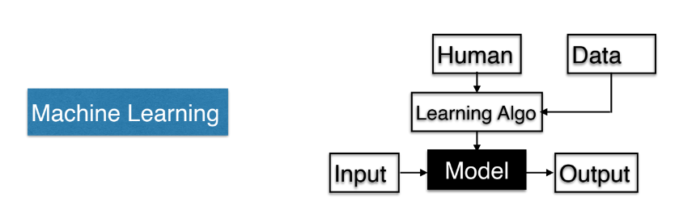

# Machine Learning

Machine learning is a learning algorithm that requires data for creating a model which can be used for solving a problem.

ML (Machine Learning) has two major branches:

1.  Supervised learning
2.  Unsupervised learning

### 1.  Supervised Learning:

Supervised Learning basically is curve fitting, i.e. A model that tries to produce output closest to actual values in data by finding a model $\mathbb{f´}$ such that $f(x^i)$ is closest to $y^i$.  

#### Linear Regression:

Suppose $T = {(x^1, y^1), (x^2, y^2), \dots, (x^n, y^n)}$ be training data, such that $x^i, y^i \in \mathbb{R}$ 
and a linear regression algorithm would generate a model $f´$ $\mathbb{R^d} \to \mathbb{R}$ that would  minimize the loss function, 
$$\begin{align}
    Loss = \frac{1}{n}\sum_{i=1}(f(x^i) - y^i)^2
\end{align}$$

#### Classification:

Suppose $T = {(x^1, y^1), (x^2, y^2), \dots, (x^n, y^n)}$ be training data, such that $x^i \in \mathbb{R}$ and $y^i \in (1,-1)$  and a linear regression algorithm would generate a model $f´$ $\mathbb{R^d} \to \mathbb{R}$ that would  minimize the loss function, \
$$\begin{align}Loss = \frac{1}{n}\sum_{i=1}(f(x^i) \neq y^i)\end{align}$$ 
where,

$$f(x) = \sin(w^T.x + b)$$ is the hypothesis function. which generally is generally used to produce binary output ranging between {-1, 1} called as a **Linear Seperator**.

> Here loss function is the fraction of misclassified values.

